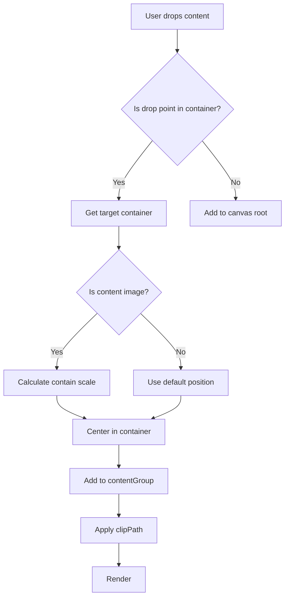
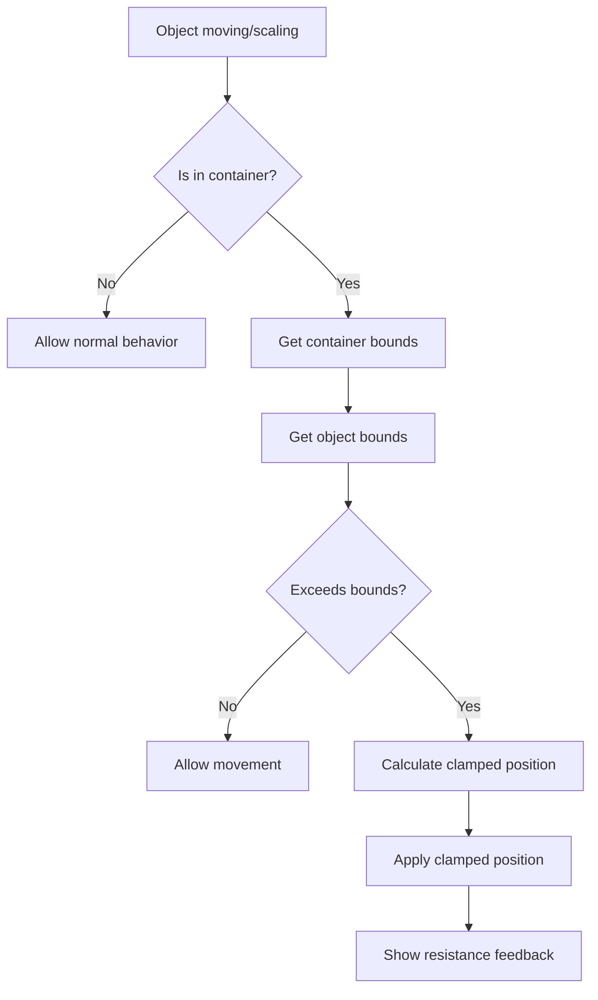

# Design Document

## ⚠️ 重要教训 (Lessons Learned)

### 第一次实现失败的原因

1. **图片加载时机问题**：使用 `fabric.Image.fromURL` 的回调方式，图片可能未完全加载就开始处理，导致图片不显示
2. **clipPath 坐标系错误**：clipPath 的坐标必须基于 contentGroup 的本地坐标，不能使用 canvas 级坐标
3. **影响了正常图片上传**：容器检测逻辑干扰了普通图片上传流程

### 必须遵守的规则

1. **图片加载**：必须使用原生 `Image` 对象的 `onload` 事件确保图片完全加载后再创建 fabric.Image
2. **clipPath 设置**：
   - `absolutePositioned` 必须设为 `false`
   - left/top 必须基于 contentGroup 的本地坐标系 (通常为 0, 0)
3. **不干扰正常流程**：容器功能只在布局模板中使用，不影响普通图片上传
4. **渲染更新**：每次修改后必须调用 `object.setCoords()` 和 `canvas.renderAll()`

## Overview

The Constrained Container feature implements a specialized layout system using fabric.js Groups with clipPath functionality. This design ensures content (images, text, brush paths) automatically adapts to container boundaries and cannot exceed them during editing.

## Architecture

```
Canvas
└── ContainerGroup (fabric.Group with isContainer: true)
    ├── frameRect (fabric.Rect) - visible boundary
    ├── contentGroup (fabric.Group) - holds all user content
    │   ├── image
    │   ├── text
    │   └── brush paths
    └── clipPath (fabric.Rect) - applied to contentGroup only
```

### Key Design Decisions

1. **ContainerGroup as Extended Group**: Use fabric.js Group with custom properties rather than creating a new class, ensuring compatibility with existing group/ungroup logic.

2. **Separate contentGroup**: All user content lives in a nested Group to isolate clipping and simplify coordinate transformations.

3. **clipPath on contentGroup**: Apply clipping only to the content layer, keeping frameRect always visible for selection.

## Components and Interfaces

### ContainerGroup Factory

```javascript
/**
 * Creates a new ContainerGroup with the required structure
 * @param {Object} options - Container options
 * @param {number} options.left - X position
 * @param {number} options.top - Y position  
 * @param {number} options.width - Container width
 * @param {number} options.height - Container height
 * @param {string} options.fill - Background fill color
 * @param {string} options.stroke - Border stroke color
 * @returns {fabric.Group} ContainerGroup instance
 */
function createContainerGroup(options)
```

### Content Management Functions

```javascript
/**
 * Adds content to a container's contentGroup
 * @param {fabric.Object} content - The content to add
 * @param {fabric.Group} container - The target ContainerGroup
 */
function addContentToContainer(content, container)

/**
 * Finds container at given canvas coordinates
 * @param {number} x - Canvas X coordinate
 * @param {number} y - Canvas Y coordinate
 * @returns {fabric.Group|null} ContainerGroup or null
 */
function findContainerAtPoint(x, y)

/**
 * Checks if an object is a ContainerGroup
 * @param {fabric.Object} obj - Object to check
 * @returns {boolean}
 */
function isContainerGroup(obj)
```

### Image Auto-Fit Functions

```javascript
/**
 * Calculates scale factor for contain mode
 * @param {number} imgWidth - Image width
 * @param {number} imgHeight - Image height
 * @param {number} containerWidth - Container width
 * @param {number} containerHeight - Container height
 * @returns {number} Scale factor
 */
function calculateContainScale(imgWidth, imgHeight, containerWidth, containerHeight)

/**
 * Fits image into container using contain mode
 * @param {fabric.Image} image - Image to fit
 * @param {fabric.Group} container - Target container
 */
function fitImageToContainer(image, container)
```

### Boundary Constraint Functions

```javascript
/**
 * Constrains object position within container bounds
 * @param {fabric.Object} obj - Object to constrain
 * @param {fabric.Group} container - Parent container
 */
function constrainToContainer(obj, container)

/**
 * Gets the content bounds of a container
 * @param {fabric.Group} container - ContainerGroup
 * @returns {Object} {left, top, width, height}
 */
function getContainerContentBounds(container)
```

### Container Transformation Functions

```javascript
/**
 * Ungroups a ContainerGroup, converting to canvas coordinates
 * @param {fabric.Group} container - ContainerGroup to ungroup
 */
function ungroupContainer(container)

/**
 * Highlights container when content is dragged over
 * @param {fabric.Group} container - Container to highlight
 * @param {boolean} highlight - Whether to show highlight
 */
function setContainerHighlight(container, highlight)
```

## Data Models

### ContainerGroup Properties

```javascript
{
  // Standard fabric.Group properties
  type: 'group',
  left: number,
  top: number,
  width: number,
  height: number,
  
  // Custom container properties
  isContainer: true,           // Identifies as ContainerGroup
  containerType: 'layout',     // Type identifier
  
  // Internal references (set during creation)
  _frameRect: fabric.Rect,     // Reference to frame
  _contentGroup: fabric.Group, // Reference to content group
  _clipPath: fabric.Rect       // Reference to clip path
}
```

### Content Object Properties

```javascript
{
  // Standard fabric object properties
  // ...
  
  // Custom properties when inside container
  _parentContainer: fabric.Group  // Reference to parent ContainerGroup
}
```

## Error Handling

### Content Placement Errors

- If drop target detection fails, content falls back to canvas root
- If container is locked, show toast message and reject content

### Boundary Constraint Errors

- If constraint calculation fails, maintain last valid position
- Log errors to console for debugging

### Transformation Errors

- If ungroup fails, maintain container state and show error toast
- If coordinate conversion fails, use approximate values

## Testing Strategy

### Unit Tests

1. **ContainerGroup Creation**
   - Verify structure (frameRect, contentGroup, clipPath)
   - Verify custom properties are set

2. **Content Placement**
   - Test image drop detection
   - Test text creation in container
   - Test brush path capture

3. **Image Auto-Fit**
   - Test contain scale calculation
   - Test centering logic
   - Test various aspect ratios

4. **Boundary Constraints**
   - Test movement constraints
   - Test scaling constraints
   - Test edge cases (corners, edges)

5. **Container Transformations**
   - Test move preserves content
   - Test scale preserves content
   - Test ungroup coordinate conversion

### Integration Tests

1. **Drag and Drop Flow**
   - Drag image from file system
   - Drop on container
   - Verify auto-fit and clipping

2. **Edit Flow**
   - Create container
   - Add multiple content types
   - Move/scale content
   - Verify constraints

3. **Compatibility Tests**
   - Test with existing group/ungroup
   - Test with existing alignment
   - Test with existing distribution

## Implementation Notes

### Event Handling Order

1. `object:moving` - Check bounds, apply constraints
2. `object:scaling` - Check bounds, apply constraints  
3. `path:created` - Check if in container, add to contentGroup
4. `drop` - Detect container, add content

### Coordinate System

- Container coordinates: relative to container origin
- Content coordinates: relative to contentGroup origin
- Canvas coordinates: absolute canvas position

### Performance Considerations

- Cache container bounds during drag operations
- Debounce constraint checks during rapid movement
- Use requestAnimationFrame for visual feedback

### Mermaid Diagram: Content Drop Flow



### Mermaid Diagram: Boundary Constraint Flow


